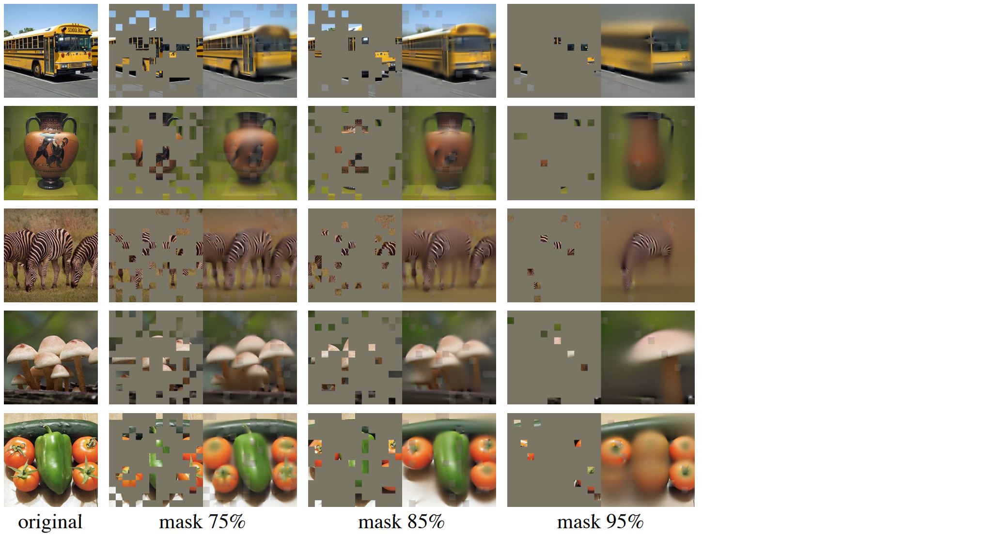
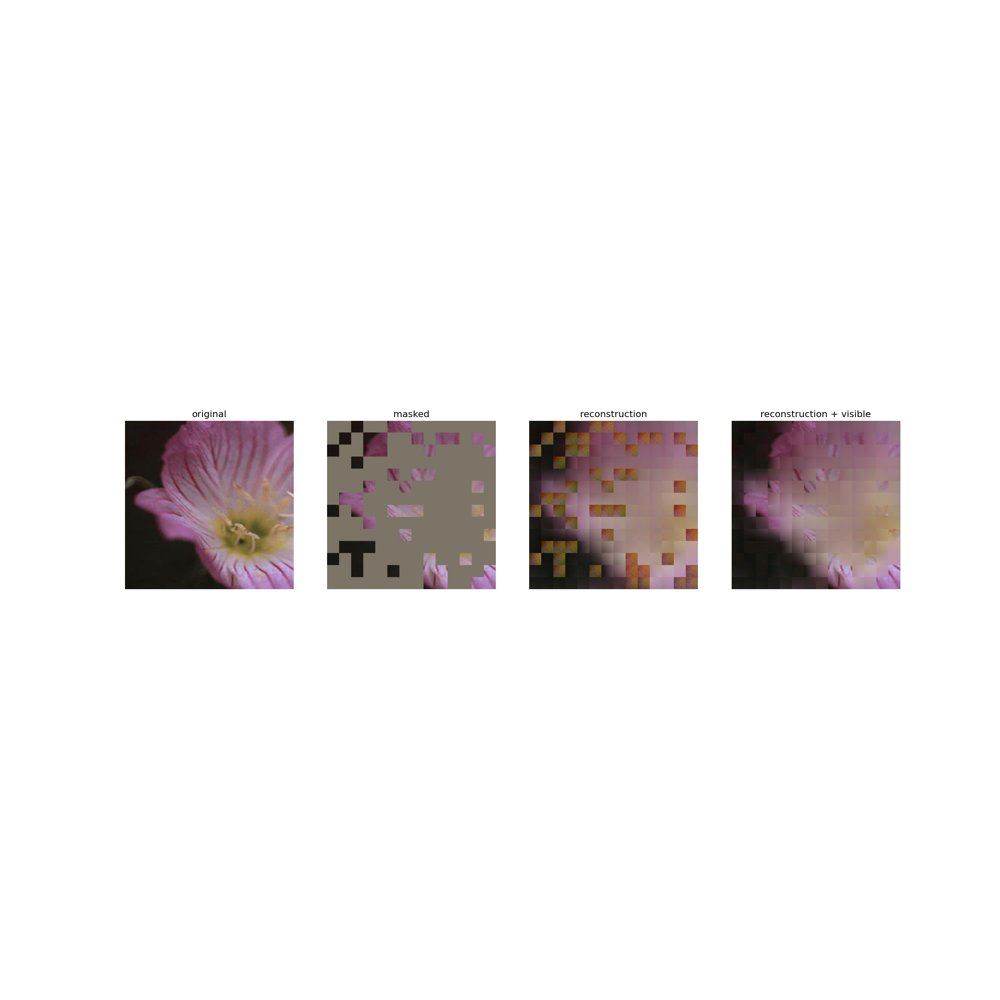
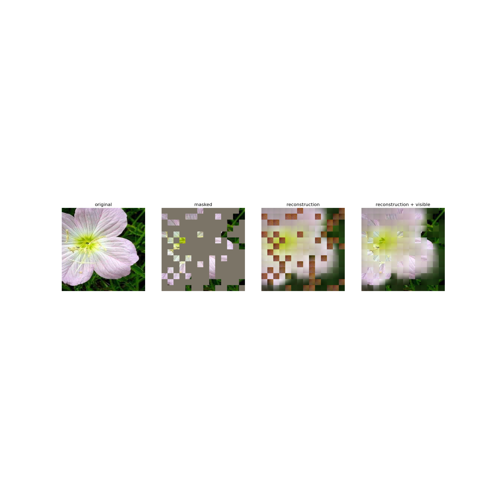
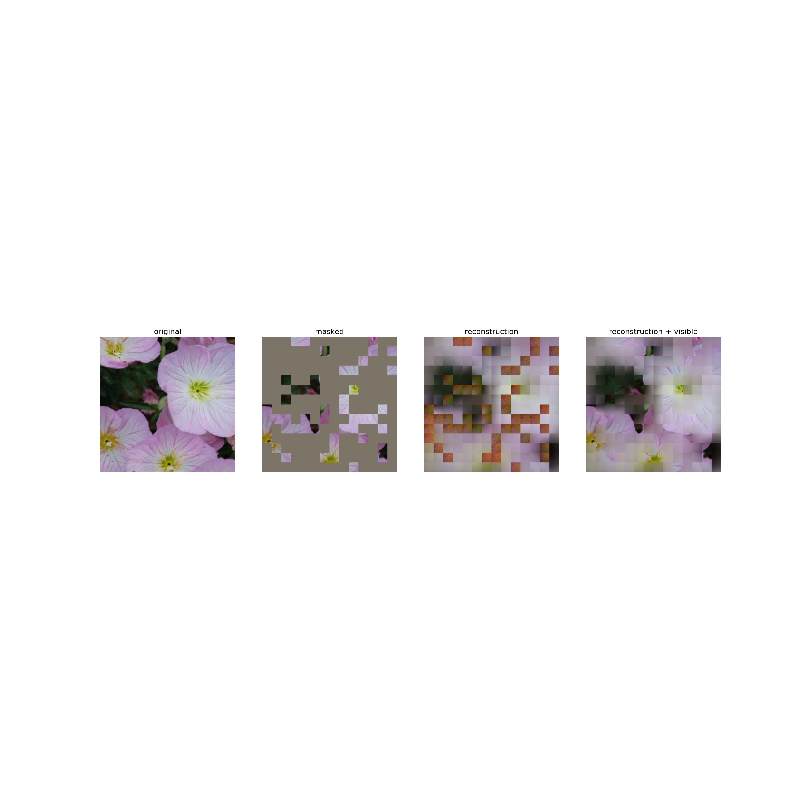

# Masked-AutoEncoders-Toy-Implementation
A toy and simple implementation to try and debug the internals of MAEs

## What is this?
Masked Autoencoder are scalable self-supervised models that consists in reconstructing random patches of the input.
This is a toy implementation using some of the code of the [official implementation](https://github.com/facebookresearch/mae). Here is also the [paper](https://arxiv.org/pdf/2111.06377.pdf).

## My Results
I trained ViTLarge with the dataset 102 Flowers and a 75% mask. The results were acceptable for a toy implementation. It was not properly trained, just enough.

